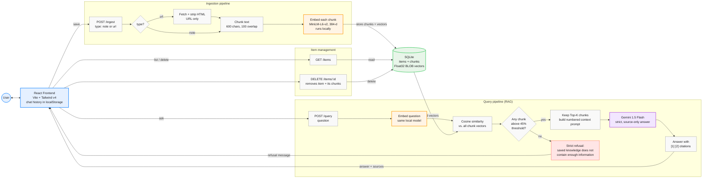

# 🧠 AI Knowledge Inbox (RecallAI)

AI Knowledge Inbox is a production-grade, full-stack personal "second-brain" web application. It allows you to save text notes and URLs, embed them into a local vector database, and query your knowledge graph using natural language. The system synthesizes answers based purely on your saved data (Retrieval-Augmented Generation), citing specific sources to guarantee hallucination-free responses.

## 🌟 Features
- **Semantic Vector Search**: Saved content is chunked, converted into dense embeddings, and searched using cosine similarity.
- **RAG Generation**: Ask a question, and the system retrieves the Top-K relevant chunks, synthesizes a factual answer, and cites its sources.
- **Automated Web Scraping**: Paste a URL, and the backend automatically extracts and cleans the readable HTML content.
- **Persistent Chat Sessions**: Chat history is persisted via `localStorage` allowing you to manage multiple conversation threads.
- **Dynamic Themes**: A premium, Apple-inspired UI built with Tailwind v4, supporting both a sleek Dark Mode (mesh gradients) and an airy Light Mode (frosted glass).

---

## 🧠 AI Models & Configuration

### 1. Large Language Model (LLM) - Synthesis
- **Model Used:** Google Gemini (`gemini-1.5-flash` or `gemini-pro`)
- **API Key Required:** `GEMINI_API_KEY`
- **Why it is best:** The Gemini Flash model offers industry-leading speed (Time-To-First-Token) and an enormous context window, making it perfect for rapid RAG synthesis. It is highly capable of following strict system instructions, such as our "Strict Refusal" prompt which forces the AI to say "The saved knowledge does not contain enough information" when retrieval yields no results.

### 2. Embeddings Model - Vector Search
- **Model Used:** `Xenova/all-MiniLM-L6-v2` (Local via HuggingFace Transformers.js)
- **Why it is best:** 
  - **Zero Cost & Zero Latency:** Embeddings run locally entirely within the Node.js backend. No network calls to OpenAI or external providers are needed.
  - **Privacy:** User notes and scraped URLs never leave the machine for embedding generation.
  - **Efficiency:** Produces dense 384-dimensional vectors that are incredibly fast to compare.

---

## 🏗 Architecture & Approaches (Why it's the best)

### System Architecture Diagram



### 1. Database & Storage Strategy
- **Tech Stack:** Embedded SQLite with BLOB storage for Vectors.
- **The Approach:** We store the `float32` embeddings directly as binary BLOBs in SQLite and compute **Cosine Similarity** locally using mathematical array processing in JavaScript. 
- **Why it is best:** This eliminates the need for complex external vector databases like Pinecone, Qdrant, or Postgres/pgvector. It guarantees that anyone pulling this repository can run `yarn install` and `yarn dev` to immediately have a working application without spinning up Docker containers or managing DB connections.

### 2. Robust RAG Pipeline
1. **Ingestion:** When a user submits a Note or URL, the backend strips HTML, cleans the text, and splits it into semantic chunks using a Fixed-window chunking strategy (600 characters with 100 character overlap).
2. **Embedding:** Each chunk generates a 384D vector locally.
3. **Retrieval (Cosine Similarity):** When the user asks a question, the query is embedded. We compare the query vector against all chunk vectors in SQLite using Cosine Similarity.
4. **Filtering:** We enforce a strict **Similarity Threshold** (currently 45%). Any chunk that falls below this threshold is dropped entirely. This prevents irrelevant data from being fed to the LLM.
5. **Synthesis:** Surviving chunks are injected into the Gemini prompt. The model synthesizes an answer and embeds specific `[1]`, `[2]` citation markers pointing directly to the chunks used.

### 3. UI / UX Design System
- **Tech Stack:** React 18, Vite, Tailwind CSS v4, Lucide React.
- **Design Philosophy:** We implemented a highly polished UI with dynamic Theme Toggling. It supports both a sleek, Perplexity-inspired Dark Mode (mesh gradients, pure blacks) and an airy Apple-style Light Mode (frosted glass, bright whites, `#F5F5F7` backgrounds). Micro-interactions (hover states, focus rings, scroll-into-view) create a premium, native-app feel.

---

## 🚀 Setup Instructions

### Prerequisites
- Node.js (v18+)
- Yarn package manager

### 1. Clone & Install
```bash
git clone <repository>
cd ai-knowledge-inbox

# Install Backend
cd backend
yarn install

# Install Frontend
cd ../frontend
yarn install
```

### 2. Environment Variables
Since API keys are sensitive, the `.env` file is intentionally ignored by Git and won't be pushed to GitHub. **You must create it manually.**

Navigate to the `backend` folder and create a new file named `.env`:
```env
PORT=3000
NODE_ENV=development
# Required for RAG synthesis (Get one from Google AI Studio)
GEMINI_API_KEY=your_gemini_api_key_here
```

### 3. Run the Application
Start both servers from their respective directories.

**Backend:**
```bash
cd backend
yarn dev
```

**Frontend:**
```bash
cd frontend
yarn dev
```
Open `http://localhost:5173` to view the application.

---

## 📝 API Endpoints

- `GET /items`: Returns all saved items (notes and URLs).
- `POST /ingest`: Expects `{ type: "note" | "url", content: "..." }`. Processes, chunks, embeds, and stores the content.
- `POST /query`: Expects `{ question: "..." }`. Runs similarity search and returns `{ answer: "...", sources: [...] }`.
- `DELETE /items/:id`: Removes an item and all associated vector chunks from the database.

---

## ⚖️ Tradeoffs & Design Decisions
- **Why SQLite?**: Simple, zero-configuration, and perfect for a single-user application. Avoids forcing the reviewer to spin up Docker containers or sign up for Pinecone.
- **Why Naive Chunking?**: A fixed-window approach (600 characters + 100 overlap) is easy to implement, lightweight, and fast enough for standard notes and articles.
- **Why In-process Vector Search?**: No separate infrastructure is needed. We store `float32` arrays as BLOBs and compute Cosine similarity directly in JS. It is incredibly fast for small datasets (thousands of vectors) and prevents network latency.
- **Frontend State:** Used pure React hooks and `localStorage` to manage chat history without needing Redux or a complex database schema for user sessions.

## 🔮 What Changes at Scale?
For a production system with thousands of concurrent users:
1. **Database**: Move to PostgreSQL with `pgvector` for scalable, indexed similarity search (e.g., HNSW indexes).
2. **Ingestion**: Move URL fetching and chunking/embedding to background queues (e.g., BullMQ, Redis) to avoid blocking HTTP requests.
3. **Security**: Add robust SSRF protection for URL fetching, rate limiting, and JWT authentication.
4. **Chunking**: Use smarter, semantic-aware chunking (e.g., splitting by markdown headers or NLP sentence boundaries) rather than arbitrary fixed windows.
5. **Caching**: Cache identical queries (e.g., Redis) and aggressively deduplicate fetched URLs.